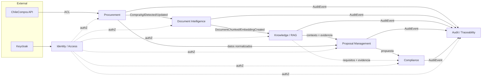

# 01 — Bounded Contexts

## Mapa de contextos

## Contextos

| Contexto | Responsabilidad | Agregados principales | Tipo de relación |
|---|---|---|---|
| **Procurement** | Sincronización, normalización y consulta de Compras Ágiles | CompraAgil, SyncExecution | ACL frente a ChileCompra (anti-corruption layer) |
| **Document Intelligence** | Ciclo de vida documental: descarga → OCR → chunks | Document | Consumidor de eventos de Procurement |
| **Knowledge / RAG** | Embeddings, índice vectorial, retrieval, evidencia, análisis IA y requisitos | AIAnalysis, Requirement, índice (derivado) | Consumidor de Document Intelligence |
| **Proposal Management** | Perfil de empresa, plantillas, propuestas versionadas | Proposal, CompanyProfile | Customer de Knowledge y Procurement |
| **Compliance** | Evaluación requisitos × propuesta | ComplianceEvaluation | Customer de Knowledge y Proposal |
| **Audit / Traceability** | Registro inmutable y navegación de lineage | AuditEvent | Downstream universal (open host) |
| **Identity / Access** | Autenticación/autorización | — (delegado en Keycloak) | Conformist frente a Keycloak |

## Logical boundary vs deployment boundary

Todos los contextos son **límites lógicos estrictos** (módulos .NET con dependencias validadas por architecture tests). El **deployment** inicial es: un modular monolith (Platform API) + tres workers (Sync, Document, AI). Ver [ADR-001](../05-architecture-decisions/ADR-001-architecture-style.md) y [ADR-012](../05-architecture-decisions/ADR-012-microservices-boundaries.md). Un contexto solo se extrae a servicio físico cuando exista razón medida (carga, aislamiento, ownership), vía strangler pattern.

## Reglas de dependencia

- Ningún contexto referencia tipos internos de otro: solo eventos publicados y contratos públicos.
- El dominio de cada contexto no depende de MongoDB, RabbitMQ, HTTP, LLM providers, Angular, Docker ni OCI: puertos e interfaces en aplicación, adaptadores en infraestructura.
- Audit es append-only y nunca es dependencia de entrada de otro contexto.
