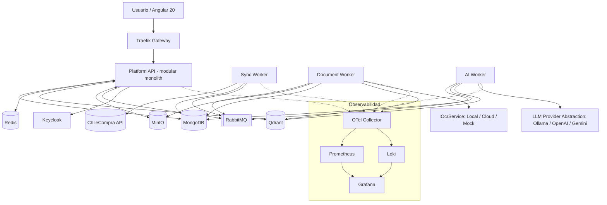

# 00 — Architecture Overview

## Estilo

**Modular monolith orientado a eventos + workers desacoplados**, con límites lógicos DDD estrictos y evolución prevista a microservicios vía strangler pattern ([ADR-001](../05-architecture-decisions/ADR-001-architecture-style.md)). El sistema completo corre en Docker Compose y cada componente local mapea a un servicio OCI ([11-oci-mapping.md](11-oci-mapping.md)).

## Piezas desplegables (FASE 1+)

| Componente | Tecnología | Responsabilidad |
|---|---|---|
| Gateway | Traefik | Enrutamiento, TLS, rate limiting, WAF-lite |
| Platform API | .NET 10 modular monolith | Módulos: Procurement, Document, Knowledge/RAG, Proposal, Compliance, Audit, CompanyProfile |
| Sync Worker | .NET 10 worker | UC-001: sincronización incremental ChileCompra |
| Document Worker | .NET 10 worker | UC-003: pipeline documental completo |
| AI Worker | .NET 10 worker | UC-004/006: análisis, requisitos, generación de secciones |
| Frontend | Angular 20 | UI completa |
| MongoDB | — | Operacional/documental + raw payloads |
| PostgreSQL | — | Auditoría/reporting (se incorpora según ADR-002) |
| MinIO | — | Objetos binarios |
| Qdrant | — | Vectores |
| Redis | — | Cache, locks distribuidos, dedupe |
| RabbitMQ | — | Bus de eventos |
| Keycloak | — | Identidad |
| Ollama | — | LLM local por defecto |
| OTel Collector + Prometheus + Grafana + Loki | — | Observabilidad |

## Decisiones estructurales clave

1. **Eventos como columna vertebral**: cada etapa del pipeline es un consumidor idempotente; reintento por etapa, no por pipeline completo.
2. **Dominio limpio**: Clean Architecture por módulo; infraestructura reemplazable (LLM, OCR, storage) mediante puertos.
3. **Datos**: raw inmutable → normalizado → derivado (chunks, vectores, análisis); todo derivado es regenerable ([../08-data/](../08-data/)).
4. **IA gobernada**: prompts versionados, structured output validado, evidencia obligatoria, human-in-the-loop.
5. **Sin sobreingeniería**: Kafka, Kubernetes y separación física de servicios son evoluciones documentadas, no punto de partida.

## Vista rápida

Documentos: [contexto](01-context-diagram.md) · [contenedores](02-container-diagram.md) · [componentes](03-component-diagram.md) · [despliegue](04-deployment-diagram.md) · [data flow](05-data-flow.md) · [event flow](06-event-flow.md) · [seguridad](07-security-architecture.md) · [observabilidad](08-observability-architecture.md) · [IA](09-ai-architecture.md) · [RAG](10-rag-architecture.md) · [OCI](11-oci-mapping.md)
