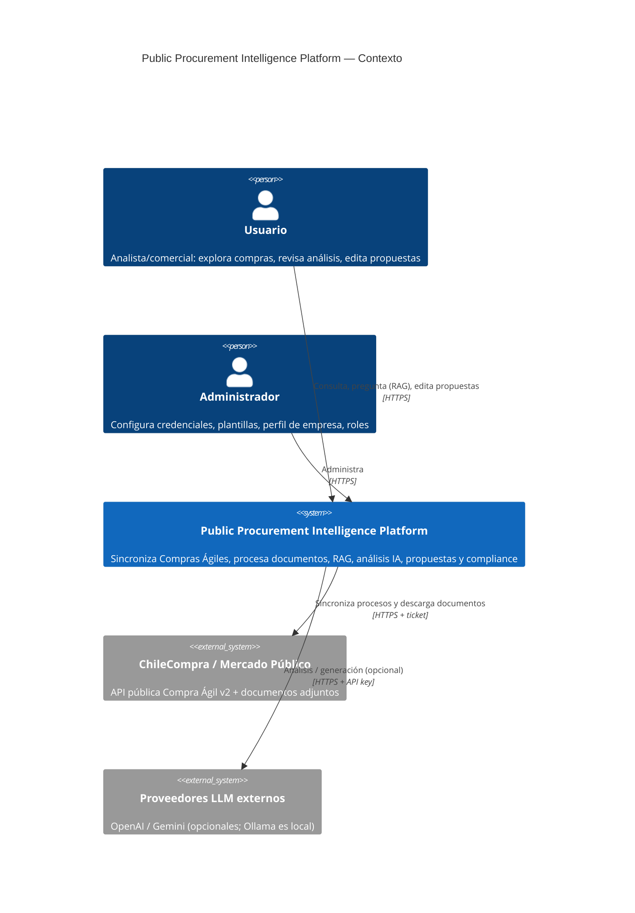

# 01 — System Context Diagram (C4 nivel 1)

## Notas

- ChileCompra es source of truth externo; el sistema mantiene copia local auditable (ACL en Procurement).
- Los proveedores LLM externos son opcionales: el sistema es demostrable 100% local con Ollama + MockOcr + seed data.
- No existe integración de salida hacia Mercado Público (no se presenta la cotización automáticamente): la propuesta generada es un entregable para que el humano la presente. Decisión consciente de human-in-the-loop y de alcance.
