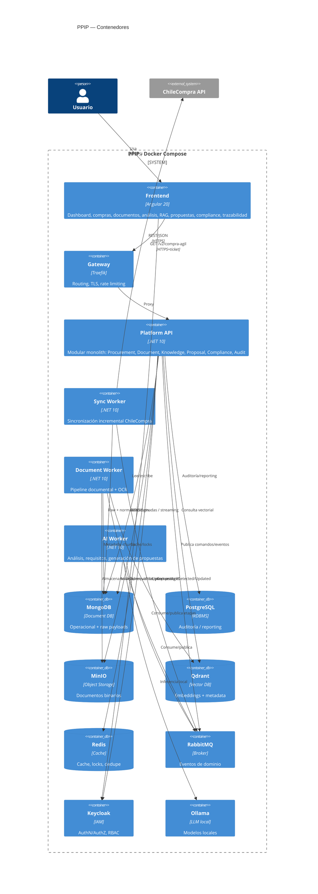

# 02 — Container Diagram (C4 nivel 2)

## Responsabilidades y límites

| Contenedor | Expone | No hace |
|---|---|---|
| Platform API | REST /api/* por bounded context | No ejecuta trabajos pesados (delega por eventos) |
| Sync Worker | health endpoints | No sirve tráfico de usuario |
| Document Worker | health endpoints | No llama al LLM de análisis (solo OCR/embeddings) |
| AI Worker | health endpoints | No accede a ChileCompra |
| Gateway | 80/443 | Sin lógica de negocio |

Escalado: workers escalan horizontalmente (competing consumers + idempotencia); la API escala en réplicas detrás de Traefik.
