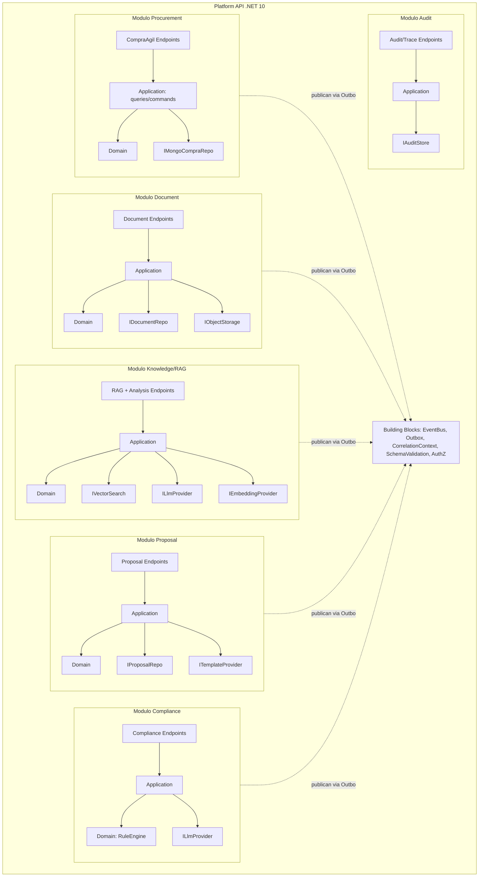

# 03 — Component Diagram (C4 nivel 3 — Platform API y Workers)

## Platform API (modular monolith)

Reglas: los módulos se comunican solo por eventos (outbox) o contratos públicos de aplicación; dominio sin referencias a infraestructura (validado por architecture tests, NFR-013).

## Sync Worker

Componentes: `Scheduler` → `SyncOrchestrator` → `ChileCompraClient` (resilience: retry, circuit breaker, rate limit, timeout) → `PayloadValidator` → `Normalizer` → `ChangeDetector` (hash) → `CheckpointStore` → `EventPublisher (outbox)`.

## Document Worker

Consumidores por etapa (uno por evento): `DownloadHandler` → `StoreHandler` → `ClassifyHandler` → `ParseHandler` → `OcrHandler (IOcrService)` → `ChunkHandler (ChunkingService)` → `EmbedHandler (IEmbeddingProvider)` → `IndexHandler (IVectorIndex)`. Cada handler: dedupe por idempotency key, precondición verificada, publicación del evento siguiente.

## AI Worker

`AnalysisHandler`, `RequirementsHandler`, `ProposalSectionHandler`, `ComplianceAssistHandler` — todos sobre `ILlmProvider` + `PromptRegistry` (versionado) + `SchemaValidator` + `CostTracker`.
