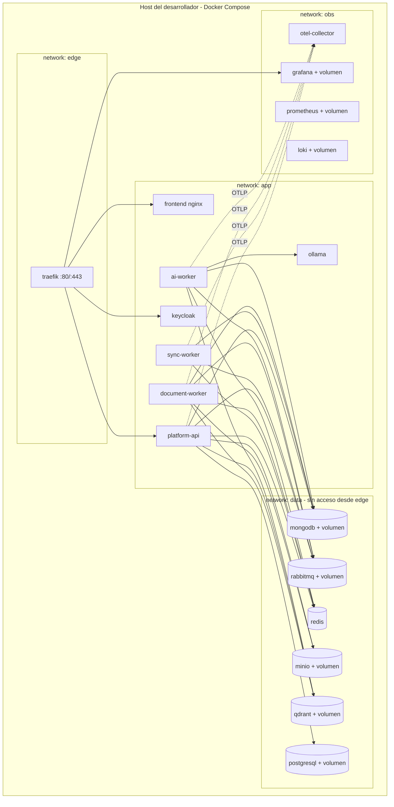

# 04 — Deployment Diagram (local, FASE 1+)

## Convenciones

- **Redes segmentadas**: `edge` (solo Traefik), `app`, `data` (sin exposición al host salvo puertos de desarrollo), `obs`.
- **Volúmenes nombrados** por servicio de datos; backups fuera de alcance del POC (documentado en operaciones).
- **Secretos**: Docker secrets / archivo `.env` no versionado; `.env.example` en el repo.
- **Health checks** en cada servicio; `depends_on: condition: service_healthy` para orden de arranque.
- **Perfiles Compose**: `core` (infra), `app`, `obs`, `demo` — permite levantar subconjuntos.
- Evolución: mismas imágenes → múltiples instancias → Kubernetes → OKE ([../17-oci-migration/](../17-oci-migration/)).
