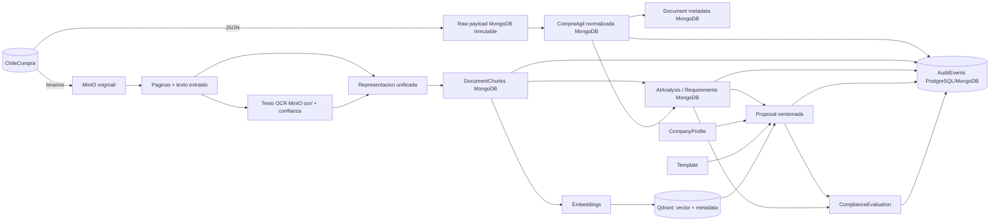

# 05 — Data Flow

## Flujo principal de datos

## Clasificación de cada dato

| Dato | Clase | Regenerable desde |
|---|---|---|
| Raw payload | Source (copia fiel) | ChileCompra (mientras exista) |
| CompraAgil normalizada | Derived | Raw payload |
| Binario documento | Source local (copia) | URL origen (mientras exista) |
| Texto extraído / OCR | Derived | Binario |
| Chunks | Derived | Texto unificado |
| Vectores Qdrant | Indexed/Derived | Chunks + modelo de embedding |
| AIAnalysis / Requirements | AI Generated (versionado) | Chunks + prompt/modelo exactos (no determinístico → por eso se versiona y audita) |
| Proposal | Mixto humano+IA | No regenerable: es artefacto de trabajo, se versiona append-only |
| AuditEvent | Registro primario | No regenerable: inmutable |

Regla: pérdida de cualquier dato *Derived/Indexed* se recupera por reproceso; pérdida de *Source local*, raw o audit es incidente (backup/retención en [../08-data/](../08-data/)).
