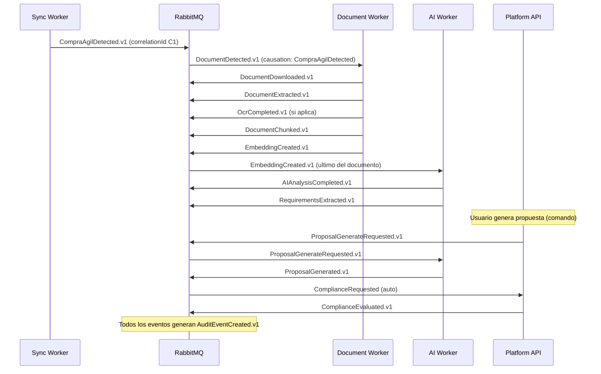

# 06 — Event Flow

## Cadena de eventos del pipeline completo

## Topología RabbitMQ

- Exchange topic `ppip.events` — routing key = `contexto.evento.version` (ej: `procurement.compra-agil-detected.v1`).
- Una cola por consumidor lógico (`document-worker.download`, `ai-worker.analysis`...), competing consumers para escalar.
- **DLQ por cola** (`*.dlq`) con TTL + reintentos escalonados (retry queues 30s/5m/1h) antes de dead-letter definitivo.
- **Outbox pattern** en cada productor: evento persistido transaccionalmente con el estado, publicado por dispatcher (at-least-once). Consumidores idempotentes por `eventId` + idempotency key de negocio.

## Garantías

At-least-once delivery; orden no garantizado entre colas → cada handler verifica precondiciones y re-encola si su insumo aún no existe (delay). Duplicados absorbidos por dedupe (Redis + unique keys en MongoDB). Compatibilidad: solo cambios aditivos en `.v1`; cambio breaking → `.v2` + consumidor dual durante transición (NFR-019).
