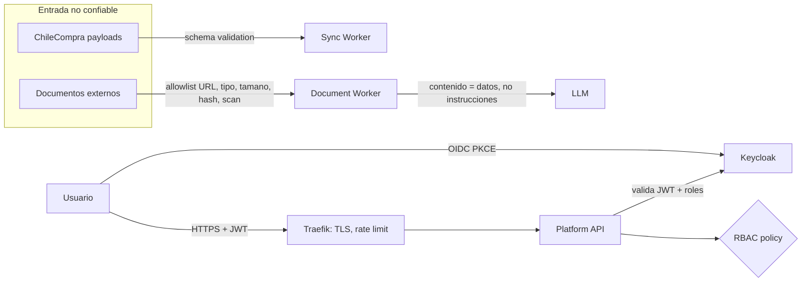

# 07 — Security Architecture

Detalle operativo y threat model en [../12-security/](../12-security/).

## Capas

1. **Edge**: TLS en Traefik, rate limiting por IP/usuario, headers de seguridad.
2. **Identidad**: Keycloak OIDC; SPA con Authorization Code + PKCE; APIs validan JWT; roles: `viewer`, `analyst`, `editor`, `admin` (matriz en docs/12).
3. **Secretos**: Docker secrets / env fuera de Git; ticket ChileCompra y API keys LLM solo en runtime; rotación documentada. → OCI Vault.
4. **Entrada no confiable**: payloads validados por schema; documentos con allowlist de dominios (anti-SSRF), validación de content-type y magic bytes, tamaño máximo, hash, abstracción `IMalwareScanner` (no-op local, real en cloud); nunca ejecutar contenido.
5. **IA**: system prompt fijo y separado del contexto documental; instrucción anti-injection explícita; salida validada por schema (nunca ejecutable); sin herramientas invocables desde contenido de documentos.
6. **Red**: segmentación Docker (data sin acceso desde edge); servicios de datos sin puertos publicados en producción-like.
7. **Auditoría**: toda operación sensible → AuditEvent inmutable.
