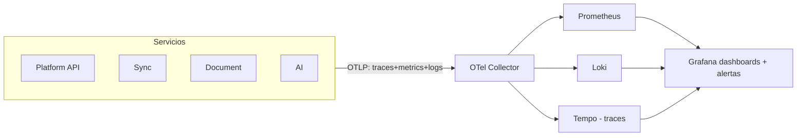

# 08 — Observability Architecture

Detalle en [../13-observability/](../13-observability/).

Implementación FASE 2: `infrastructure/docker/docker-compose.yml` (perfil `obs`) + `infrastructure/docker/config/{otel-collector,prometheus,loki,tempo,grafana}/`. Backend de traces: Tempo (ADR-011 Amendment 2026-08-16).

## Convenciones

- **Correlación**: `traceId` (W3C traceparent) + `correlationId` de negocio propagados por HTTP y por headers de mensajes RabbitMQ; ambos en todo log estructurado (JSON).
- **Métricas mínimas** (nombres estables): `chilecompra_api_latency`, `chilecompra_api_errors_total`, `chilecompra_quota_errors_total`, `queue_depth`, `worker_stage_duration`, `ocr_duration`, `llm_duration`, `llm_tokens_total`, `embedding_duration`, `rag_latency`, `proposal_generation_latency`, `compliance_duration`.
- **Dashboards**: Sync health, Document pipeline, AI cost & latency, RAG quality, API overview.
- **Health**: `/health` (liveness básico), `/ready` (dependencias), `/live` donde aplique; incluidos checks de ChileCompra, LLM y OCR provider como *degraded*, no *down* (NFR-006).
- SLIs/SLOs se definen tras baseline de FASE 18 (no antes — MP2 §44).
