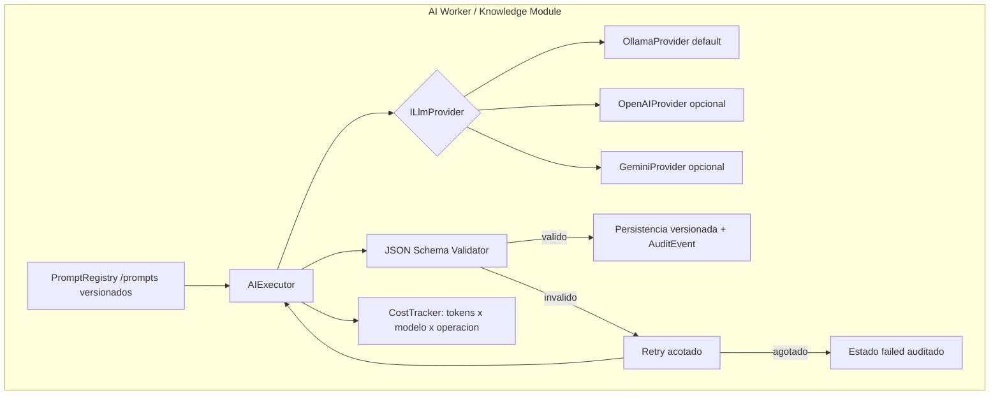

# 09 — AI Architecture

Gobernanza completa en [../11-ai/](../11-ai/).

## Reglas estructurales

1. `ILlmProvider` e `IEmbeddingProvider` son puertos del dominio de aplicación; el dominio nunca conoce el proveedor ([ADR-007](../05-architecture-decisions/ADR-007-llm-abstraction.md)).
2. Cada ejecución registra `AIExecution`: promptId+version, modelo+version, temperatura, tokens, costo, duración, inputHash, outputHash, correlationId.
3. Modelos pequeños para clasificación/routing; modelos grandes solo donde aportan (análisis, generación) — control de costo NFR-016, cache de resultados por inputHash.
4. Structured output obligatorio: `AnalysisResult`, `RequirementsResult`, `ProposalSectionResult`, `ComplianceResult` (schemas en docs/11).
5. Human-in-the-loop: nada generado por IA llega a estado `approved` sin acción humana.
