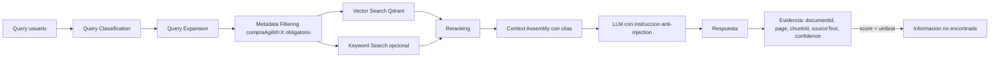

# 10 — RAG Architecture

Especificación completa en [../10-rag/](../10-rag/).

Principios: RAG **por compra** (filtro obligatorio), evidencia siempre, sin fallback al conocimiento paramétrico del modelo para hechos del proceso, retrieval medible etapa por etapa (precision/recall en /evaluation).
