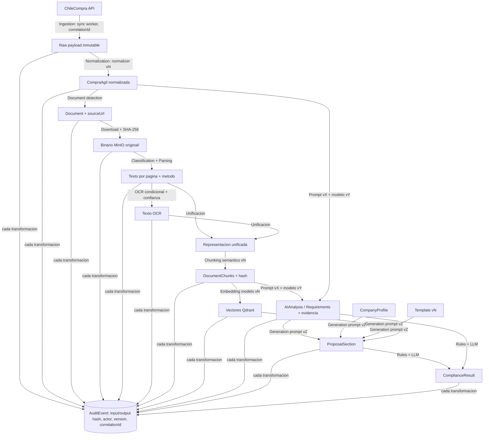

# 03 — Data Lineage

## Registro por transformación

Cada flecha del grafo persiste en su AuditEvent: qué entró (inputHash), qué salió (outputHash), quién (actor/servicio/versión), con qué (promptVersion/modelVersion/algoritmo vN), cuándo, y bajo qué correlationId. Esto hace posible UC-009: dada una afirmación en una propuesta, llegar en N saltos hasta la línea del PDF y la llamada HTTP original.

## Invalidación en cascada

Documento nuevo/versión nueva → invalida (marca stale, no borra): chunks → vectores → análisis → secciones generadas basadas en esa evidencia → evaluaciones de compliance. La UI muestra qué está stale; el reproceso es explícito (humano o job), nunca silencioso.
